*******************
Trouver ses repères
*******************

Cette partie du manuel a pour but de familiariser l’utilisateur à iCure.

Naviguer dans iCure
===================

Ce logiciel fonctionne selon plusieurs principes simples de navigation.

.. tip:: Pour naviguer dans iCure.

  - Barre d'onglets.
  - Raccourci clavier nouvelle fenêtre « ⌘-N ».
  - Raccourcis clavier vers modules « Option (⌥)-1 » à « Option (⌥)-9 ».
  - Ouvrez un autre module en cliquant 1 seconde sur le + dans la barre d'onglet.
  - Cliquez sur la croix à gauche de l'onglet dans lequel vous êtes pour le fermer. (Vous ne pouvez pas fermer le 1er onglet)

Vous pouvez, à tout moment, ouvrir une nouvelle fenêtre principale en choisissant "Nouvelle fenêtre" dans le menu fichier ou en util- isant le raccourci « ⌘-N ».

Il est possible de travailler avec plusieurs fenêtres ouvertes simultanément.

Une croix à côté du nom du patient vous permet, à tout moment, de refermer un dossier patient |screenshot_en-tete_patient| pour accéder à la liste de vos patients.

.. |screenshot_en-tete_patient| image:: images/screenshot_en-tete_patient.png

Pour tous les autres modules, vous trouverez une croix placée directement sur l'onglet du module.

.. image:: images/screenshot_close_module.png

.. note::
  Si vous n’êtes pas dans un dossier, la liste vous est proposée mais il n’y a pas de croix. Vous pouvez choisir d’ouvrir n’importe quel dossier.

.. image:: images/screenshot_tab_patient.png

La barre d'onglet vous permet de passer d'un module d'iCure à l'autre.

Appuyez sur le bouton "+" pendant une seconde, un menu vous propose alors une sélection des modules.

.. image:: images/screenshot_open_module.png

Ce menu de sélection des modules permet d'ouvrir facilement un autre module.

Vous pouvez aussi accéder directement à un module via le menu Outils ou grâce à un raccourci clavier :

- Rapports : « ⌥ 0 »
- Dossiers Patients : « ⌥ 1 »
- Messages : « ⌥ 2 »
- Médecins : « ⌥ 3 »
- Personnel : « ⌥ 4 »
- Médicaments : « ⌥ 5 »
- Hôpitaux : « ⌥ 6 »
- Formulaire : « ⌥ 7 »
- Modèles : « ⌥ 8 »
- Assurance : « ⌥ 9 »

Dans la partie supérieure de la fenêtre principale se trouve la barre d'outils avec les fonctionnalités de base (dans ce cas, celles du module « Dossiers patients ») :

.. image:: images/screenshot_toolbar_patient.png

Cette barre d’outils évolue, comme vous allez le voir ci-dessous, en fonction du module dans lequel vous vous trouvez. Certains éléments sont communs.
Les autres varient pour vous proposer les fonctionnalités adéquates à l’usage du module.

Les éléments communs à tous les modules sont :
----------------------------------------------

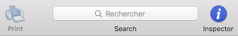

- **Imprimer**
- Le **champ de recherche** permet de faire une recherche sur l'ensemble des éléments ou selon l'élément sélectionné.
  La recherche peut également se réaliser en fonction de filtres accessibles par la petite flèche dans le champs de recherche.
- **L'inspecteur** permet d'avoir accès à la fenêtre "Objects" permettant des actions différentes selon l'élément sélectionné.

Les éléments particuliers à chaque module sont :
------------------------------------------------

Module "Dossier Patients"
^^^^^^^^^^^^^^^^^^^^^^^^^

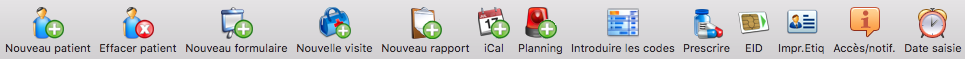

- **Nouveau patient** permet d'ajouter un nouveau patient à votre logiciel.
- **Effacer patient** permet de supprimer un patient.
- **Nouveau formulaire** permet d'ouvrir un nouveau formulaire. Vous pouvez en choisir le modèle en fonction du besoin du moment.
- **Nouvelle visite** permet d'ouvrir un formulaire de consultation d'un clic.
- **iCal** permet d'enregistrer un rendez-vous sur iCal directement à partir du dossier d'un patient.
- **Planning** permet d'inscrire des rappels dans la fenêtre de plannings.
- **Introduire les codes** INAMI de prestation
- **Prescrire** permet de confirmer la création d'une prescription ou de renouveler facilement une ancienne.
- **EID** permet d'ouvrir et de mettre à jour un patient à partir de sa carte d'identité
- **Imprimer.Etiq** permet d'imprimer une fiche d'identification du patient au format étiquette.
- **Accès/notif**
- **Date saisie** permet de définir l'heure de la consultation

.. \* ces fonctions n’apparaissent dans la barre d’outil que lorsque vous êtes dans un nouveau rapport.

Module "Dossier Patient" > Création de rapport
^^^^^^^^^^^^^^^^^^^^^^^^^^^^^^^^^^^^^^^^^^^^^^

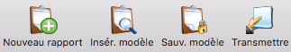

- **Nouveau rapport** permet d'ouvrir un nouveau rapport. Vous pouvez choisir d'ouvrir le type de modèle de lettres ou autres certificats que vous voulez.
- **Isérer le modèle** permet d'utiliser un modèle de rapport enregistré.
- **Sauver le modèle** permet d'enregistrer un rapport comme modèle afin de pouvoir le réutiliser.
- **Transmettre** permet de sauvegarder le rapport sous forme d'un fichier en dehors du programme et éventuellement de l'échanger avec d'autres médecins.

Module "Prestataires de soins"
^^^^^^^^^^^^^^^^^^^^^^^^^^^^^^

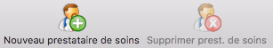

- **Nouveau prestataire de soins** permet d'ajouter un nouveau médecin. Une fiche administrative vierge s'ouvre vous permettant de lier le nouveau docteur à un ou plusieurs patients ainsi qu'à une ou plusieurs institutions hospitalières.
- **Supprimer prestataire de soins** permet de supprimer un médecin.

Module "Messages"
^^^^^^^^^^^^^^^^^

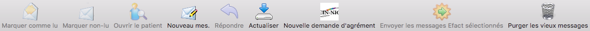

- **Marquer comme lu** permet de sélectionner plusieurs messages et de les marquer comme ayant été ouverts(lu).
- **Marquer non-lu** permet de donner un mail consulté l'apparence de ne pas avoir été ouvert.
- **Ouvrir le patient** permet d'ouvrir le parient dont le mail parle.
- **Nouveau message** permet de rédiger un nouveau message.
- **Répondre** au message sélectionné.
- **Actualiser** pour recharger le contenu du dossier ouvert.
- **Nouvelle demande d'agrément**
- **Envoyer les messages Efact sélectionnés** permet d'envoyer des factures qui seraient en attente dans la boite d'envoi
- **Purger les vieux messages**

Modules "Administration"
^^^^^^^^^^^^^^^^^^^^^^^^

.. error:: Données insuffisantes pour compléter cette documentation

Le module d'administration reprend plusieurs page d'informations concernant les Utilisateurs, les Assurances, les réplications, les codes, les mutuelles, les codes de tarifications...

.. liste de module présent dans la version 3.7.2 mais pas trouver dans la version 4.0.0
  -> sont probablement repris par le module d'administration
  Module "Rapport"
  Module "Médicaments"
  Module "Utilisateurs"
  Module "Formulaire"
  Module "Hopitaux"
  Module "Assurance"
  Module "Modèles"
  Module "Filtres"

Effectuer une recherche
=======================

Toute recherche au sein d’iCure se base sur le même principe. Un champ de recherche s’applique à chaque élément sélectionné.

.. tip::
  Faire une recherche

  - Utilisez le champ de recherche.
  - La flèche à côté de la loupe dans le champ de recherche permet d’accéder aux différentes options.
  - La recherche est effectuée parmi les patients si aucun patient n’est sélectionné.
  - La recherche se fait dans l’élément sélectionné d’un dossier si un patient est sélectionné.

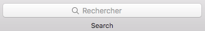

Le champ de recherche est accessible à tout moment dans iCure.
Les données sur lesquelles la recherche s'effectue dépendent du contexte.
Ainsi, la recherche se fera toujours au sein du module sélectionné dans la barre d'onglet.

**Par exemple,** prenez le module « Dossiers patients ».

Tout ce qui suit concerne ce module mais le processus de recherche
est semblable dans les autres modules.

**Lorsqu'un patient est sélectionné,** son nom apparaît dans la colonne de gauche.
Le titre de la fenêtre change également pour prendre le nom du patient.
Une croix à côté de l'icône du module vous permet, à tout moment, de refermer le dossier de ce patient.
Pour accéder à la liste de vos patients, cliquez sur cette croix.

**Si aucun patient n'est sélectionné,** la colonne de gauche reste vide et la recherche s'effectue sur l'ensemble des dossiers patients.

Lorsque rien n’est encodé dans le champ de recherche, votre iCure affiche la liste des patients par ordre chronologique inversé.
Les derniers dossiers patient consultés se trouvent en haut de la liste.

Le contenu de cette liste est déterminé par la configuration de votre logiciel (voir l’onglet « Général » des Préférences iCure).

Si vous voulez obtenir la liste entière de vos patients, tapez le signe « % » dans le champ de recherche.

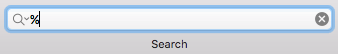

La liste complète apparaît.

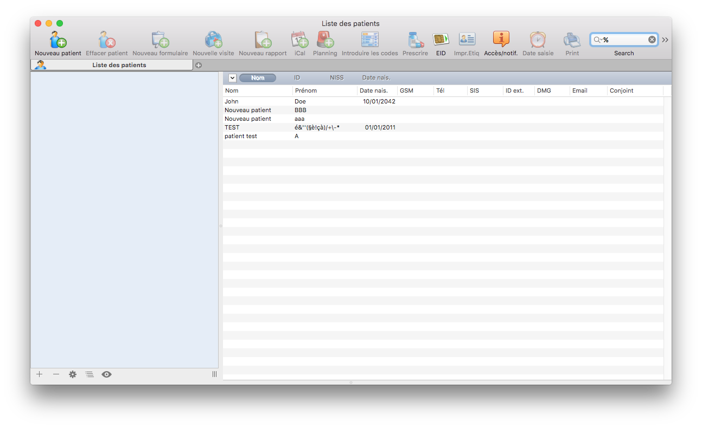

.. tip::
  Le fait d’entrer le signe « % » dans le champ de recherche permet, de manière générale, dans iCure, d’obtenir la liste de données attenantes aux modules dans lequel vous vous trouvez.

Tapez quelques lettres dans le champ suivies du signe «%», une liste s’affichent avec tous les noms de patients, médecins, hôpitaux... commençant par les lettres encodées.

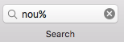

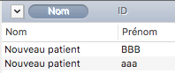

Les colonnes de la zone de recherche affichent le nom, le prénom, la date de naissance, adresse, téléphone, le numéro NISS du patient, "Contenu" pour une recherche sur le contenu, "Tout" pour effectuer une recherche sur l'ensemble des critères.

Pour effectuer une recherche, choisissez le type de données voulu. Encodez les premières lettres du mot recherche, votre iCure fait le reste.

La flèche, à côté du champ de recherche , vous permet (dans le module patient) d’accéder aux filtres et de les appliquer sur l’ensemble des patients.

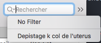

**Si aucun patient n’est sélectionné,** la recherche porte sur l’ensem- ble des patients. Encodez les premières lettres, des colonnes s’affichent dans la zone de droite de la fenêtre.

Vous pouvez cliquer sur n’importe quel élément (Nom, ID, NISS, Date nais.)

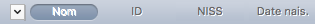

Les données correspondant à votre recherche s’affichent dans ces colonnes.

**Si un patient est sélectionné,** la recherche dépend de l'élément sélectionné dans la hiérarchie à gauche de l'écran.

**Si la fiche administrative ou le dossier ”Transactions“ sont sélectionnés,** c'est sur l'ensemble des données médicales du patient que se fait la recherche.

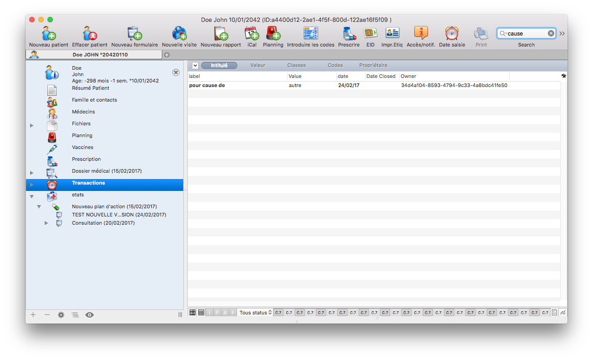

Les critères de recherche sont : Intitulé, Valeur, Classes, Codes, Propriétaire.

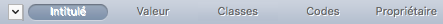

Comme lorsqu’aucun patient n’est sélectionné, les données correspondant à votre recherche s’affichent dans ces colonnes.

**Si ”Médecins“, ”Fichiers“, ”Vaccins“ ou ”Planning“ sont sélectionnés,** la recherche porte sur les données correspondantes (médecins, fichiers, vaccins ou planning). De la même manière, si un dossier in- telligent, une démarche ou un élément de soin font l'objet de la sélection, la recherche est limitée aux éléments contenus dans ce dossier.

Créer un nouveau patient
========================

Ce point est destiné à l’explication du processus de création d’un nouveau dossier patient et à la complétion de sa fiche administrative.

.. note::
  Pour créer un nouveau patient :

  1. Cliquez sur l'icône nouveau patient |bouton_new_patient| dans la barre d'outils du module "Dossiers patients"|bouton_list_patient|.
  2. Encodez les informations du patient.
  3. Cliquez sur les différents éléments pour prendre connaissance du dossier.

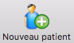

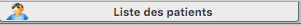

Structure du dossier patient
============================

Organiser l'information
-----------------------

Les éléments de soin
^^^^^^^^^^^^^^^^^^^^

Les démarches
^^^^^^^^^^^^^

Les formulaires
^^^^^^^^^^^^^^^

Les services
^^^^^^^^^^^^

Enregistrer un élément de soin comme modèle
^^^^^^^^^^^^^^^^^^^^^^^^^^^^^^^^^^^^^^^^^^^

Utiliser un modèle d'élément de soin modèle
^^^^^^^^^^^^^^^^^^^^^^^^^^^^^^^^^^^^^^^^^^^
.. Titre à corriger !

Créer sa propre structure d'élément de soin par défaut
^^^^^^^^^^^^^^^^^^^^^^^^^^^^^^^^^^^^^^^^^^^^^^^^^^^^^^

Introduire des données dans un dossier patient
==============================================

Configurer iCure
================
