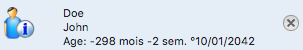
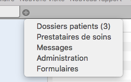
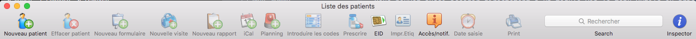

*******************
Trouver ses repères
*******************

Cette partie du manuel a pour but de familiariser l’utilisateur à iCure.

Naviguer dans iCure
===================

Ce logiciel fonctionne selon plusieurs principes simples de navigation.

.. tip:: Pour naviguer dans iCure.

  - Barre d'onglets.
  - Raccourci clavier nouvelle fenêtre « ⌘-N ».
  - Raccourcis clavier vers modules « Option (⌥)-1 » à « Option (⌥)-9 ».
  - Ouvrez un autre module en cliquant 1 seconde sur le + dans la barre d'onglet.
  - Cliquez sur la croix à gauche de l'onglet dans lequel vous êtes pour le fermer. (Vous ne pouvez pas fermer le 1er onglet)

Vous pouvez, à tout moment, ouvrir une nouvelle fenêtre principale en choisissant "Nouvelle fenêtre" dans le menu fichier ou en util- isant le raccourci « ⌘-N ».

Il est possible de travailler avec plusieurs fenêtres ouvertes simultanément.

Une croix à côté du nom du patient vous permet, à tout moment, de refermer un dossier patient |screenshot_en-tete_patient| pour accéder à la liste de vos patients.

Pour tous les autres modules, vous trouverez une croix placée directement sur l'onglet du module.

.. note::
  Si vous n’êtes pas dans un dossier, la liste vous est proposée mais il n’y a pas de croix. Vous pouvez choisir d’ouvrir n’importe quel dossier.

La barre d'onglet vous permet de passer d'un module d'iCure à l'autre.

Appuyez sur le bouton "+" pendant une seconde, un menu vous propose alors une sélection des modules.

Ce menu de sélection des modules permet d'ouvrir facilement un autre module.

Vous pouvez aussi accéder directement à un module via le menu Outils ou grâce à un raccourci clavier :

- Rapports : « ⌥ 0 »
- Dossiers Patients : « ⌥ 1 »
- Messages : « ⌥ 2 »
- Médecins : « ⌥ 3 »
- Personnel : « ⌥ 4 »
- Médicaments : « ⌥ 5 »
- Hôpitaux : « ⌥ 6 »
- Formulaire : « ⌥ 7 »
- Modèles : « ⌥ 8 »
- Assurance : « ⌥ 9 »

Dans la partie supérieure de la fenêtre principale se trouve la barre d'outils avec les fonctionnalités de base (dans ce cas, celles du module « Dossiers patients ») :

Cette barre d’outils évolue, comme vous allez le voir ci-dessous, en fonction du module dans lequel vous vous trouvez. Certains éléments sont communs. Les autres varient pour vous proposer les fonctionnalités adéquates à l’usage du module.

Les éléments communs à tous les modules sont :
----------------------------------------------

Les éléments particuliers à chaque module sont :
------------------------------------------------

Module "Dossier Patients"
^^^^^^^^^^^^^^^^^^^^^^^^^

Effectuer une recherche
=======================

Créer un nouveau patient
========================

Structure du dossier patient
============================

Organiser l'information
-----------------------

Les éléments de soin
^^^^^^^^^^^^^^^^^^^^

Les démarches
^^^^^^^^^^^^^

Les formulaires
^^^^^^^^^^^^^^^

Les services
^^^^^^^^^^^^

Enregistrer un élément de soin comme modèle
^^^^^^^^^^^^^^^^^^^^^^^^^^^^^^^^^^^^^^^^^^^

Utiliser un modèle d'élément de soin modèle
^^^^^^^^^^^^^^^^^^^^^^^^^^^^^^^^^^^^^^^^^^^
.. Titre à corriger !

Créer sa propre structure d'élément de soin par défaut
^^^^^^^^^^^^^^^^^^^^^^^^^^^^^^^^^^^^^^^^^^^^^^^^^^^^^^

Introduire des données dans un dossier patient
==============================================

Configurer iCure
================
